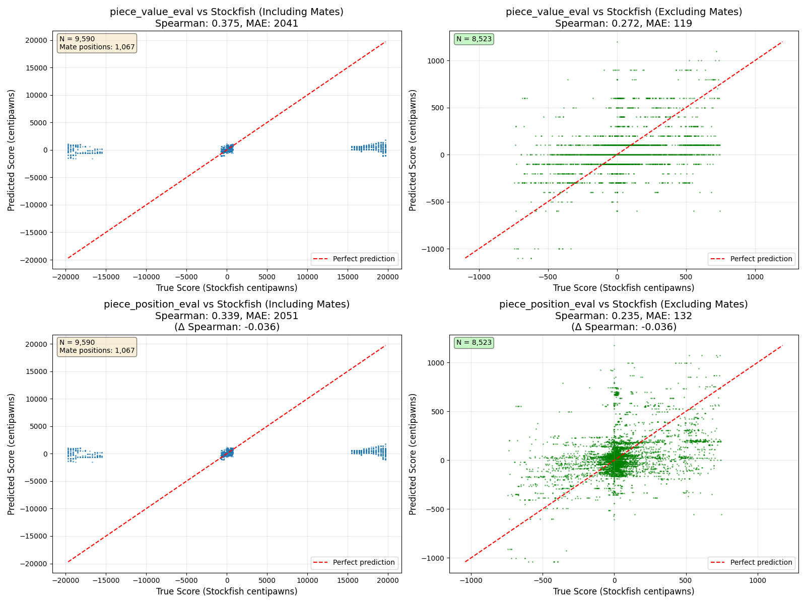

# Supervised Learning Chess

Two goals:
1. Learn a value function to score board positions
2. Learn a policy model to directly predict next moves

Both of these will be "pretraining" incorporated into a future RL Actor Critic Model

## Datasets
I want to train a single model with two heads, predicting both board balue and next move,
so I need a dataset that has both of those in each row. (Ideally also previous move, as I
think that contains some good signal even though the board is techncially markov)

`https://huggingface.co/datasets/Lichess/chess-position-evaluations`

This contains both scores (cp/mate) and next move (line)!

```
{
  "fen": "2bq1rk1/pr3ppn/1p2p3/7P/2pP1B1P/2P5/PPQ2PB1/R3R1K1 w - -",
  "line": "g2e4 f7f5 e4b7 c8b7 f2f3 b7f3 e1e6 d8h4 c2h2 h4g4",
  ...
  "cp": 311,
  "mate": None
}
```

More details in `1-data-exploration.ipynb`

Backup datasets:
- https://huggingface.co/datasets/Lichess/standard-chess-games
    - Contains full games, but only About 6% of the games include Stockfish analysis evaluations: 
- https://csslab.cs.toronto.edu/datasets/#maia_kdd

## Board Evaluation

`2-eval-accuracy.py`

eval functions should have the signature: `chess.Board -> centipawn score (max 20k)`

### Versions
- baseline: `piece_value_eval()` just sums up the value of material
- `piece_position_eval()` heuristic that uses positions of pieces




```
piece_value_eval (BASELINE):
  WITH mates:
    Mean Absolute Error: 2040.90 centipawns
    Spearman correlation: 0.375
    Correct winner prediction: 47.4%
piece_position_eval:
  WITH mates:
    Mean Absolute Error: 2050.53 centipawns
    Spearman correlation: 0.339
    Correct winner prediction: 57.3%
    vs baseline: MAE -10, Spearman -0.036, Win% +10.0
```

### Basic scikit learn value model

