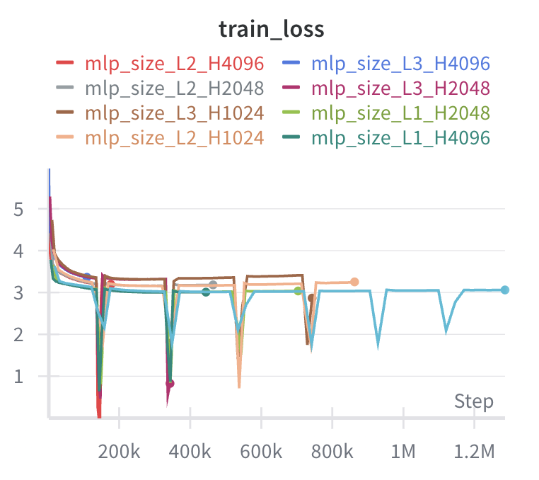
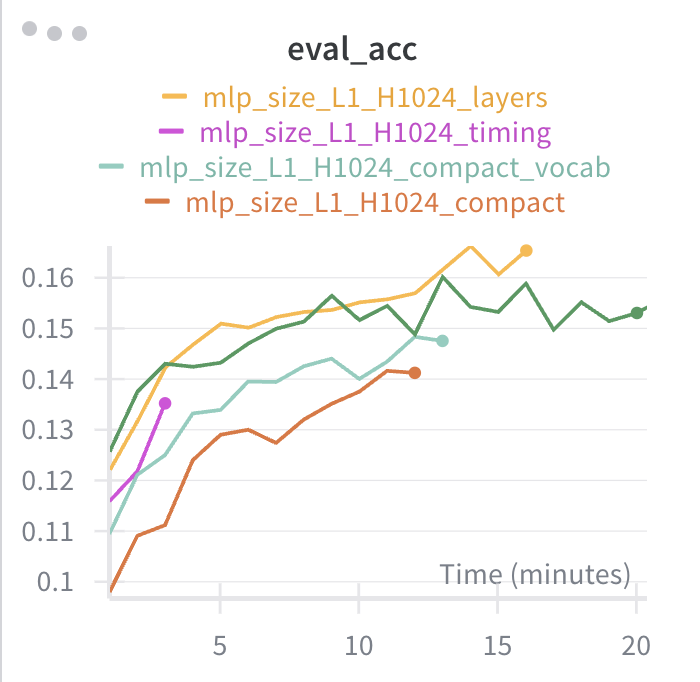
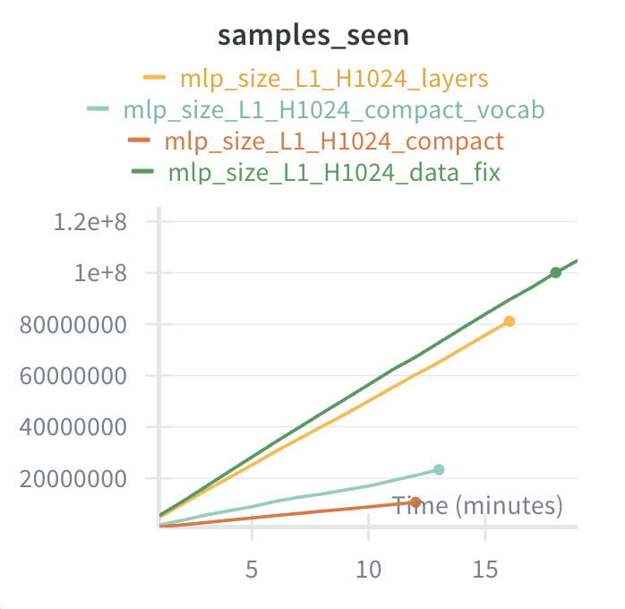
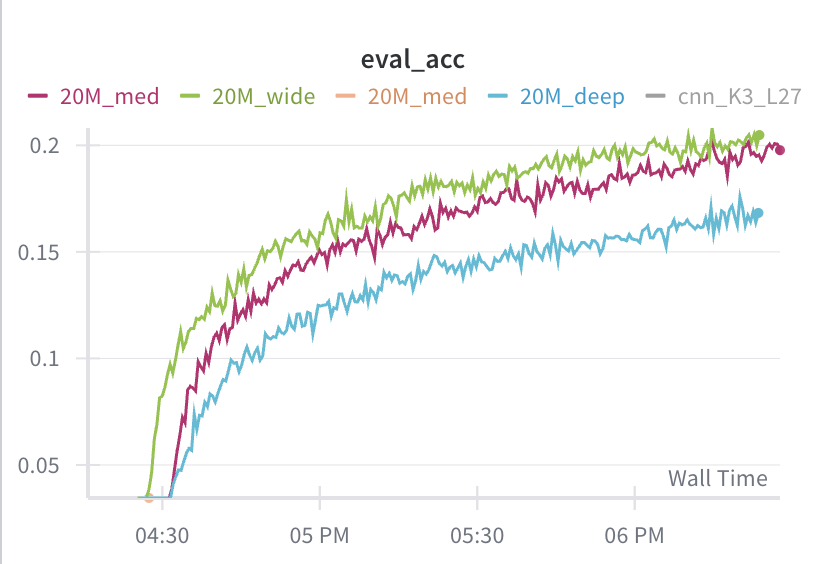
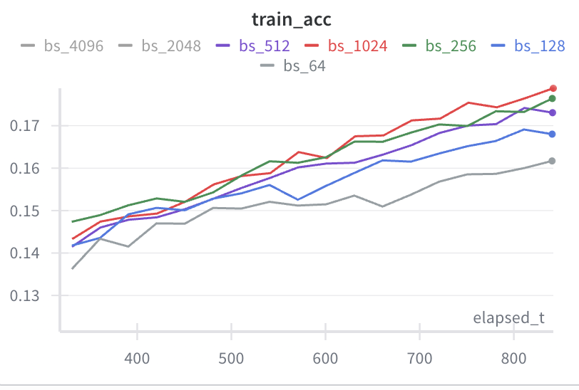
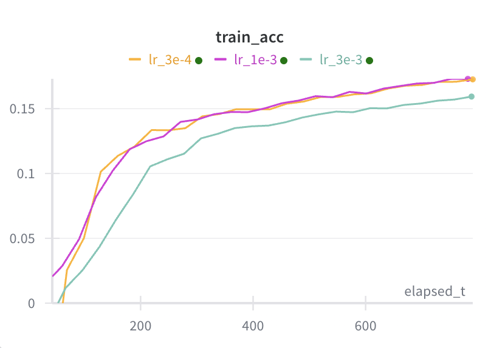
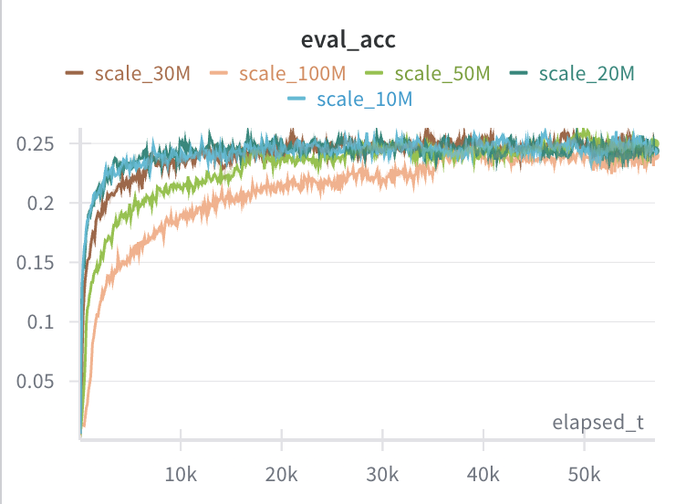

# Experiments

## 2026-01-01: Dataset Size vs Overfitting

**Goal**: Determine how much training data is needed to avoid overfitting.

**Setup**:
- Model: 2-layer MLP, 256 hidden units, 705k parameters
- Output: 1968 possible UCI moves
- Features: Piece-square encoding (779 features)
- Training: 5 minutes, batch size 256, lr 0.001
- Eval set: 10k held-out positions

### Results

| num_train | Epochs | Train Acc | Eval Acc | Eval Top5 | Eval Loss Trend      |
|-----------|--------|-----------|----------|-----------|----------------------|
| 10k       | 3,904  | 99.8%     | 4.7%     | 15.8%     | 18 → 47 (explodes)   |
| 100k      | 322    | 86.6%     | 7.8%     | 28.8%     | 6 → 18 (explodes)    |
| 1M        | 35     | 24.1%     | 13.4%    | 46.2%     | 3.4 → 3.6 (stable)   |
| 10M       | 3      | 15.3%     | 14.6%    | 50.6%     | 3.4 → 3.1 (improving)|

### Observations

1. **Overfitting threshold at ~1M samples**: Below 1M, eval loss explodes during training. At 1M+, eval metrics stay stable or improve.

2. **Train/eval gap closes with more data**: At 10M samples, train and eval accuracy are nearly identical (15.3% vs 14.6%), indicating the model is learning generalizable patterns rather than memorizing.

### Conclusion
Re-architected the data loader to use the full 784M rows.

## 2026-01-03: MLP Scaling Experiment and Data Corruption

**Goal**: Find the optimal MLP size for chess move prediction.

**Setup**:
- Sweep over depth (1-3 layers) and width (1024-4096 hidden units)
- 50M training samples, 10k eval
- Training: 1 hour per run, batch size 256, lr 0.001
- All 9 configurations run in parallel on Modal

### Results

| Name              | Eval Acc | Layers | Hidden | Params     |
|-------------------|----------|--------|--------|------------|
| mlp_size_L1_H2048 | 15.59%   | 1      | 2048   | 5,629,872  |
| mlp_size_L1_H4096 | 15.40%   | 1      | 4096   | 11,257,776 |
| mlp_size_L1_H1024 | 14.93%   | 1      | 1024   | 2,815,920  |
| mlp_size_L2_H4096 | 14.59%   | 2      | 4096   | 28,039,088 |
| mlp_size_L2_H2048 | 14.18%   | 2      | 2048   | 9,826,224  |
| mlp_size_L2_H1024 | 14.02%   | 2      | 1024   | 3,865,520  |
| mlp_size_L3_H2048 | 13.11%   | 3      | 2048   | 14,022,576 |
| mlp_size_L3_H4096 | 12.75%   | 3      | 4096   | 44,820,400 |
| mlp_size_L3_H1024 | 12.06%   | 3      | 1024   | 4,915,120  |



### Observations

1. **Deeper models performed worse**: 1-layer MLPs consistently outperformed 2-layer and 3-layer variants, regardless of width. This is counterintuitive - more capacity should help.

2. **Suspicious loss spikes**: All models showed periodic downward spikes in training loss, followed by loss going *higher* than before. These correlated with drops in eval accuracy.

3. **Spikes at identical steps**: When graphing by step instead of wall-clock time, all 9 runs spiked at the exact same training step. This ruled out optimizer dynamics and pointed to corrupted data.

### Root Cause: Corrupted Training Data

The precompute pipeline used memory-mapped numpy files (`np.lib.format.open_memmap`) which pre-allocate with zeros. During an earlier run, one worker stalled mid-write. The resume logic only checked file length, not content - so the partially-written shard (real data followed by thousands of zero rows) was marked as complete.

Result: Contiguous blocks of all-zero feature vectors in the training data. The model could easily "learn" these (predict most common move for zero input), causing:
- Sharp drop in training loss on zero batches
- Overfitting that damaged generalization
- Higher loss on subsequent real data

### Fix

1. Added validation: check that last and middle rows of each shard are non-zero before concatenating
2. Re-ran precomputation from scratch

NOTE: Reran with the fix - spikes were gone, loss curve was the same.

## 2026-01-11: Training Pipeline Optimization

**Goal**: Have a flexible data representation so that I can do experiments on features without needing to rerun pre-compute. 

Iterations:
1. **Compact + 20k output**: Store boards as int8 piece codes (64 bytes/sample), expand to 12 binary planes on GPU. Output all 64×64×5 = 20,480 possible moves.
2. **Compact + vocab**: Same storage, but build vocab of ~1,968 actually-occurring moves. Reduces output layer from 21M to 2M params.
3. **Planes**: Precompute boards as 13 binary uint8 planes (12 pieces + en_passant). GPU work reduces to single `.float()` cast.

**Setup**: L1 H1024, 50M samples.

| Iteration               | Throughput | Speedup | Bottleneck               | Fix                               |
|-------------------------|------------|---------|--------------------------|-----------------------------------|
| Compact + 20k output    | 14,700/sec | 1.0x    | Output layer (21M params)| Build vocab of ~1,968 moves       |
| Compact + vocab         | 29,400/sec | 2.0x    | GPU expansion (fwd 43%)  | Precompute binary planes          |
| Pre-expanded planes     | 83,400/sec | 5.7x    | Backward pass (36%)      | —                                 |





**Storage tradeoff**: Planes format is 42 GB vs 6.8 GB for compact (6x larger), but 2.8x faster than compact+vocab.

**Final state**: Backward pass (actual gradient compute) is now the dominant cost. One epoch over 50M samples takes ~10 minutes.

## 2026-01-17: CNN Kernel Size vs Depth

**Goal**: Compare small-kernel-deep vs large-kernel-shallow CNNs at constant parameter count (~10M).

**Setup**:
- Architecture: ResNet-style CNN with pre-norm, GELU, 2 convs per residual block
- Input: 18 channels (13 piece planes + 5 broadcasted meta channels)
- Output: Linear head to 1,968 moves (~8M params, constant across configs)
- Fixed: hidden_channels=64, batch_size=256, lr=0.001
- Training: 1 hour per run, 50M samples
- Sweep: kernel_size with num_layers adjusted to keep conv params ~2M

| Config | Kernel | Layers | Conv Params | Receptive Field |
|--------|--------|--------|-------------|-----------------|
| K3_L27 | 3      | 27     | ~2.0M       | 55 squares      |
| K5_L10 | 5      | 10     | ~2.0M       | 41 squares      |
| K7_L5  | 7      | 5      | ~2.0M       | 31 squares      |
| K9_L3  | 9      | 3      | ~2.0M       | 25 squares      |
| K11_L2 | 11     | 2      | ~2.0M       | 21 squares      |
| K15_L1 | 15     | 1      | ~1.8M       | 15 squares      |

### Results

| Config   | Kernel | Layers | Params     | Eval Acc |
|----------|--------|--------|------------|----------|
| K3_L27   | 3      | 27     | 10,518,000 | **20.49%** |
| K5_L10   | 5      | 10     | 10,313,072 | 17.92%   |
| K7_L5    | 7      | 5      | 10,217,200 | 17.39%   |
| K9_L3    | 9      | 3      | 10,204,656 | 16.55%   |
| K11_L2   | 11     | 2      | 10,226,032 | 15.87%   |
| K15_L1   | 15     | 1      | 10,190,064 | 15.44%   |

### Conclusions

1. **Small kernels + depth wins**: Despite K15_L1 having best early accuracy (large receptive field learns fast), K3_L27 ultimately won by 5 percentage points. The ranking is almost perfectly monotonic with kernel size.

2. **Depth enables hierarchical features**: Small 3×3 kernels can only see local patterns, but stacking 27 layers lets the network build increasingly abstract representations. This beats "seeing everything at once" with a 15×15 kernel.

**Next steps**: Try even deeper networks with K=3, explore residual connection variants, add torch.compile() for speedup.

## 2026-01-17: Model Scaling - Deep vs Wide

**Goal**: Compare deep vs wide architectures at larger parameter counts (20M, 30M).

**Setup**:
- Architecture: Same ResNet-style CNN, K=3 fixed (winner from kernel sweep)
- Training: 2 hours per run, 50M samples, AdamW, torch.compile()
- Sweep: Vary hidden_channels (H) and num_layers (L) to hit 20M and 30M targets

| Config | Hidden | Layers | Target |
|--------|--------|--------|--------|
| 20M_deep | 96 | 48 | 20M |
| 20M_med | 112 | 27 | 20M |
| 20M_wide | 128 | 14 | 20M |
| 30M_deep | 112 | 71 | 30M |
| 30M_med | 144 | 32 | 30M |
| 30M_wide | 176 | 14 | 30M |

### Results

| Config | Hidden | Layers | Params | Eval Acc |
|--------|--------|--------|--------|----------|
| 20M_med | 112 | 27 | 21,017,760 | **19.70%** |
| 20M_wide | 128 | 14 | 20,752,176 | 19.54% |
| 30M_wide | 176 | 14 | 30,662,400 | 18.28% |
| 20M_deep | 96 | 48 | 21,272,784 | 16.75% |
| 30M_med | 144 | 32 | 31,313,760 | 15.08% |
| 30M_deep | 112 | 71 | 32,224,032 | 14.00% |

### Conclusions

1. **Larger models underperformed**: The 10M baseline (20.49%) beat all 20M and 30M models. Loss curves showed models were still improving at 2 hours, suggesting larger models need more training time to converge.

2. **Wide beats deep at fixed param count**: Within each size class, wider/shallower models outperformed deeper/narrower ones. The very deep variants (48-71 layers) struggled most.

3. **Sweet spot for depth is ~14-27 layers**: With K=3, 14 layers gives receptive field of 29 (covers the board). Beyond that, width helps more than additional depth.

**Refined architecture guidance**:
- K=3 (small kernels for hierarchical features)
- 14-27 layers (enough depth for full-board receptive field)
- Scale via width, not extreme depth



**Next steps**: Run promising configs (20M_med, 20M_wide, 30M_wide) for longer (4-6 hours) to see if larger models can catch up.

## 2026-01-17: Batch Size Sweep (A10 GPU)

**Goal**: Find optimal batch size for 24hr scaling runs on A10 GPU.

**Setup**:
- Model: 20M wide (H=128, L=14, K=3)
- GPU: A10G (24GB VRAM)
- LR: 0.001 (constant across all batch sizes)
- Training: 1 hour per config

### Results

| Batch Size | Samples @ 13min | Eval Acc @ 13min | GPU Memory |
|------------|-----------------|------------------|------------|
| 64 | 3.1M | 15.4% | — |
| 128 | 3.7M | 17.3% | — |
| 256 | 4.6M | 17.2% | — |
| 512 | 4.8M | 17.3% | — |
| 1024 | 5.2M | **18.1%** | ~12% |
| 2048 | — | — | ~25% |

### Conclusions

1. **Larger batches win on both throughput and accuracy**: bs_1024 saw 67% more samples than bs_64 in the same time, and achieved higher accuracy. No critical batch size degradation observed.

2. **Memory limits batch size for larger models**: bs_2048 used 25% GPU memory on 20M model. Since 100M model is ~5x larger, bs_1024 (~12% memory) is the safe choice for scaling runs.



**Selected**: batch_size=1024 for 24hr scaling experiment.

## 2026-01-17: Learning Rate Sweep

**Goal**: Find optimal learning rate for bs=1024 before 24hr scaling runs.

**Setup**:
- Model: 20M wide (H=128, L=14, K=3)
- Batch size: 1024
- GPU: A10G
- Training: 1 hour per config

### Results

| Learning Rate | Eval Acc @ 14min | Loss |
|---------------|------------------|------|
| 1e-3 | **17.9%** | 2.841 |
| 3e-4 | 17.5% | 2.869 |
| 3e-3 | 15.4% | 2.971 |



### Conclusions

- **lr=0.001 confirmed**: Current default is optimal. 3e-4 is slightly slower, 3e-3 is too high.

**Final config for 24hr scaling**: K=3, L=14, bs=1024, lr=0.001, A10G.

## 2026-01-18: Model Scaling Experiment (16 hours)

**Goal**: Scale model size from 10M to 100M parameters with extended training time.

**Setup**:
- Architecture: K=3, L=14 fixed (wide scaling via hidden_channels)
- Batch size: 1024, LR: 0.001, AdamW
- GPU: A10G, Training: ~16 hours per config
- Data: 50M samples

| Config | Hidden | Params | Target |
|--------|--------|--------|--------|
| scale_10M | 72 | ~10M | 10M |
| scale_20M | 128 | ~20M | 20M |
| scale_30M | 176 | ~30M | 30M |
| scale_50M | 264 | ~51M | 50M |
| scale_100M | 432 | ~101M | 100M |

### Results

| Model | Samples Seen | Train Acc | Eval Acc | Train-Eval Gap |
|-------|--------------|-----------|----------|----------------|
| scale_10M | 536M (10+ epochs) | 26.2% | 24.6% | +1.6% |
| scale_20M | 435M (8+ epochs) | 30.0% | 24.4% | +5.6% |
| scale_30M | 210M (4+ epochs) | 26.7% | 24.9% | +1.8% |
| scale_50M | 86M (1.7 epochs) | 25.3% | 24.7% | +0.6% |
| scale_100M | 39M (0.8 epochs) | 24.7% | 24.0% | +0.7% |

### Observations



**All models hit ~24-25% eval accuracy ceiling**: Despite 10x difference in parameters and 14x difference in samples seen, eval accuracy stayed within a 1% band.

### Root Cause: Label Noise in Training Data

Investigated why all models plateau at the same accuracy regardless of capacity.

**Analysis of first 100k samples from source dataset:**
```
Total samples: 100,000
Unique FENs: 13,929
Ratio: 7.18 samples per unique FEN
FENs with conflicting labels: 10,925 (78.4%)
```

The training data comes from Lichess's crowdsourced Stockfish analyses. The same position appears multiple times with **different "best moves"** because analyses were run at different depths. With 78% of positions having multiple conflicting labels, there's an irreducible error floor.

**Example of conflicting labels:**
```
fen: 7r/1p3k2/p1bPR3/5p2/2B2P1p/8/PP4P1/3K4 b - -
  Analysis 1: f7g7 (depth ?)  cp: 69
  Analysis 2: h8d8 (depth ?)  cp: 163
  Analysis 3: h8a8 (depth ?)  cp: 229
```

Same position, three different "correct" moves in the training data.

### Conclusions

1. **Model capacity is not the bottleneck**: The 24-25% ceiling is set by data quality, not model expressiveness.

2. **More training time won't help**: Larger batch sizes see more epochs faster, leading to overfitting rather than improvement.

3. **Data deduplication is required**: Need to aggregate by FEN and either:
   - Keep only the highest-depth analysis per position
   - Create soft labels weighted by analysis depth

**Next steps**: Precompute deduplicated dataset with soft labels (depth-weighted move distributions) to remove label noise ceiling.

# Future Planned Experiments

- [x] I need to confirm the best strategy for combining duplicate rows (soft labels vs throw out non-max)
  - [ ] verify that i can get above 24% acc
- [ ] measure how much noise is in my system with several runs of exactly the same settings
- [ ] systems efficiency: increase vocab size to be a power of 2? learning rates / $ on different GPUs.