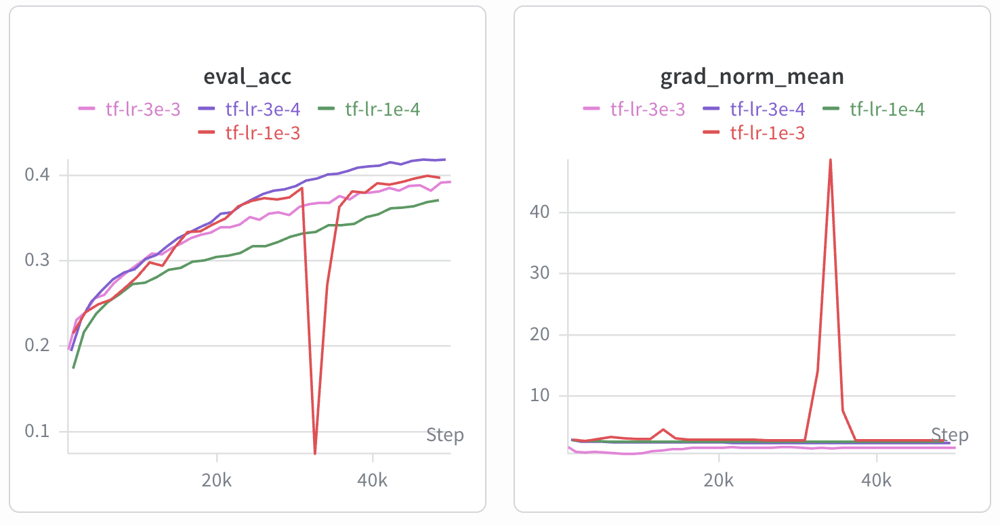
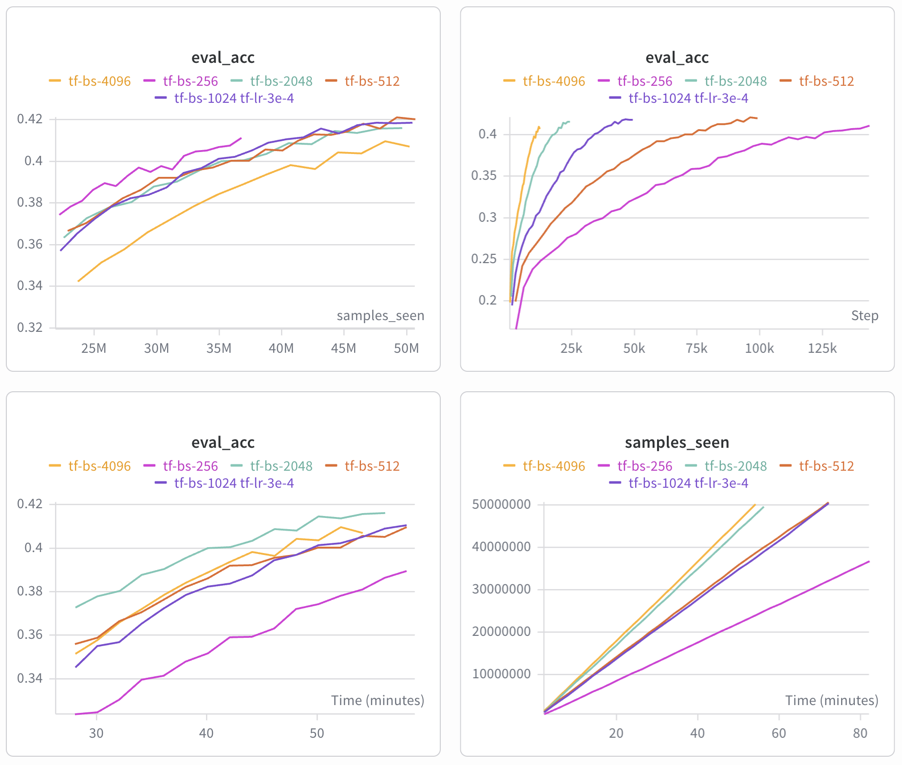
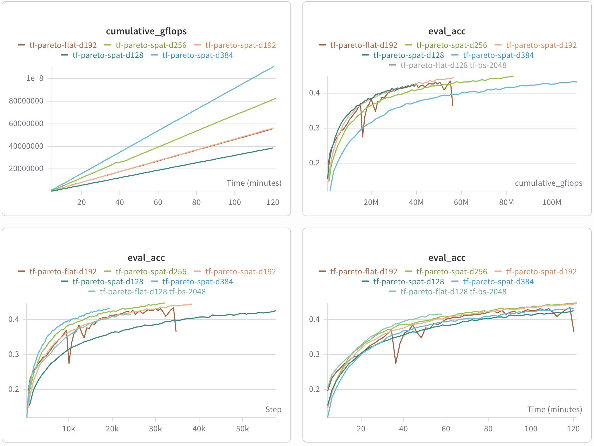
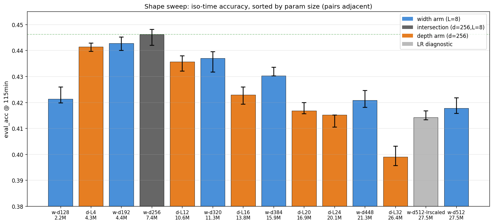
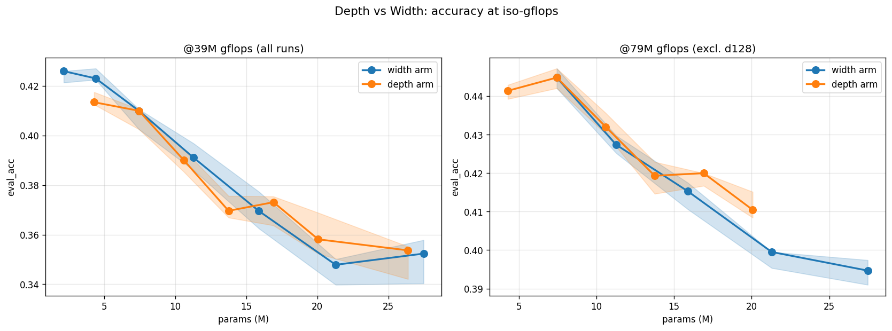
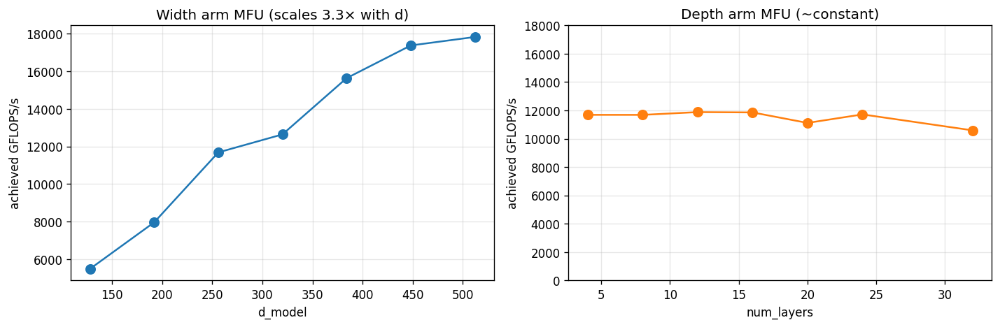
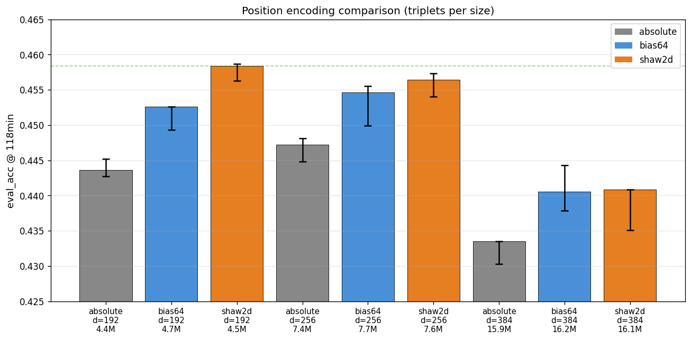
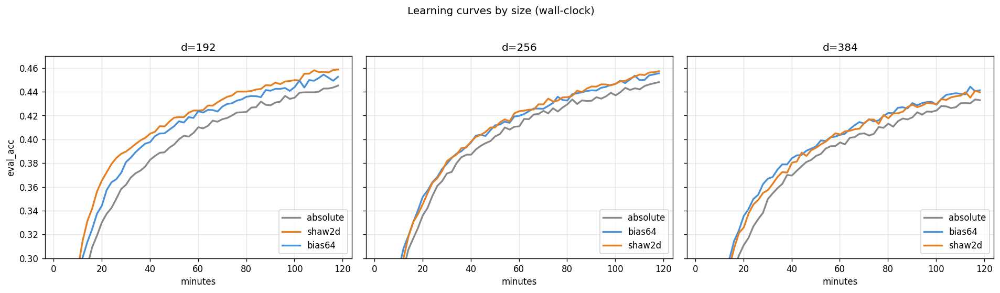
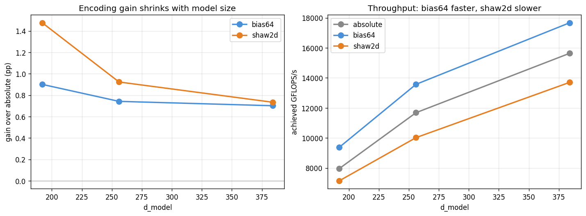

# CNN State of the Art (2026-03)

### Best result

| Model | H | Params | Steps | Epochs | Eval Acc | Deep Acc | Time |
|-------|---|--------|-------|--------|----------|----------|------|
| scale-20M | 128 | 20.5M | 533k | 1.6 | **50.5%** | **58.0%** | 10h |
| scale-40M | 224 | 41.7M | 199k | 0.6 | 50.4% | 57.9% | 10h |

20M and 40M are tied at 10 hours, but 40M saw only 0.6 epochs vs 1.6 — per-sample, 40M learns faster. Neither is converged; both would improve with more compute.

### Architecture

- **Backbone**: ResNet-style CNN, K=3 kernels, L=14 residual blocks (2 convs each), pre-norm RMSNorm + GELU
- **Input**: 13 piece/EP planes + 4 castling channels (17 total with flip), board normalized to current player's perspective
- **Output**: flatten → `RMSNorm → Linear(H*64, 1968)`

### Training recipe

- **Optimizer**: AdamW, lr=1e-3, wd=0.01, cosine decay
- **Batch**: bs=1024, BF16 autocast, `torch.compile`
- **Data**: full 342M unique positions, soft labels (Boltzmann-weighted cp at max depth, temp=50cp), min_depth=0, flip_board=True
- **Infra**: Modal A10G, background prefetch (queue=2), eval every 120s on 50k held-out

### What we know (solid)

- **K=3 deep > large-kernel shallow** (5pp, monotonic)
- **Flip helps ~2.5pp** — learns color-symmetric patterns once
- **BF16 is free** — 1.6× speedup, no accuracy loss
- **Cosine > constant LR** at iso-step (direction solid, magnitude likely inflated)
- **wd=0.01 > wd=0** (~1pp, borderline)
- **Policy is local** — per-from-square features suffice; spatial_unshared head matches flatten
- **From×to interaction matters** (factored head −4.2pp), **per-square specialization matters** (shared −2.7pp vs unshared)
- **Not data-limited** — train/eval gaps <0.5%, larger models have steeper per-sample log-slopes

### What we don't know (revisit for transformers)

- **Depth**: L=14 was chosen under an old recipe; the 14-vs-27 comparison was 0.16pp (noise). Re-sweep.
- **Batch size**: never tested with LR scaling; bs=1024 might not be optimal.
- **LR warmup**: never tested; larger models (80M+) may need it to not diverge early.
- **Actual scaling ceiling**: log-linear extrapolation suggests 40M→58.7% at 10× compute, but unvalidated.

### What to carry to transformers

- Flip, BF16, prefetch, cosine, wd=0.01 — all validated, port directly
- Use `spatial_unshared` head (per-token C→68 decoder), not flatten — verified equivalent, much smaller
- Start with per-square tokenization (64 tokens) — fixed-length, maps naturally to the spatial head
- Re-sweep depth, batch size, and LR from scratch — CNN values are likely suboptimal for attention

# Transformer Experiments

## 2026-03-23: LR Sweep + Stability

**Setup**: d=128, L=8, heads=8, 17.7M params. Constant LR, grad_clip=1.0, warmup=500, wd=0.01, bs=1024, 50k steps. Dataloader seed=42 → all runs see identical batch sequences.

| LR | eval_acc (last-5) | deep_acc | max grad_norm | spikes (>10) |
|----|-------------------|----------|---------------|--------------|
| **3e-4** | **41.7%** [41.3, 41.9] | **49.8%** | 5.0 | 0 |
| 1e-3 | 39.5% [39.0, 39.9] | 47.7% | **2038** | 7 |
| 3e-3 | 38.9% [38.3, 39.3] | 46.8% | 35 | 3 |
| 1e-4 | 36.6% [36.2, 37.1] | 41.5% | 4.6 | 0 |

All bands separated — not noise.

**1e-3 is unstable.** At step 33k, grad_norm spiked to 2038 → eval_acc crashed 38%→7%, recovered to 39% but never caught up. Pre-crash it was ~1pp behind 3e-4 (borderline noise), so the final gap is mostly crash damage. Same-seed data means 3e-4 saw the identical batch with grad_norm ≤ 5 — the instability is LR-dependent (model state in sharp region), not a bad batch.

**3e-3 more stable than 1e-3**: partly luck (3 spikes vs 7), partly that steps are too large to settle into sharp regions. Still had minor spikes; could blow up on longer runs.

**Grad clipping enabled recovery** (previous unclipped 1e-3 run stayed broken) but didn't prevent the crash — clipped step in a garbage direction still destabilizes.

**Conclusions**: Standardize on **LR=3e-4**. Added `grad_skip_threshold=50` (skip update if grad_norm > 50) as tail-risk insurance.

**Next**: batch size sweep with LR ∝ √(bs/1024).

## 2026-03-23: Batch Size Sweep

**Setup**: d=128, L=8, lr = 3e-4 × √(bs/1024), warmup/steps scaled inversely (iso-token ≈ 51M samples). bs=1024 baseline reused from `tf-lr-3e-4`. All stable — grad_skip never fired, peak grad_norm ≤ 8.1.

| bs | lr | throughput vs 1024 | eval_acc @ 36.7M | band |
|----|----|--------------------|------------------|------|
| 256 | 1.5e-4 | 0.64× | **41.15%** | [40.7, 41.1] |
| 512 | 2.12e-4 | 1.00× | 40.04% | [39.6, 40.6] |
| 1024 | 3e-4 | 1.00× | 40.23% | [39.7, 40.9] |
| **2048** | **4.24e-4** | **1.26×** | 40.01% | [39.0, 40.4] |
| 4096 | 6e-4 | 1.33× | (lowest, ~39%) | — |

Compared at 36.7M samples (bs=256 stopped early). 512/1024/2048 bands all overlap — within noise per-sample. bs=256 is ~1pp ahead per-sample but costs 2× wall-clock. bs=4096 underperforms — likely √-scaling breaking down at lr=6e-4 (halfway to the unstable 1e-3 zone).

**Throughput gain at bs=2048 is real** (confirmed by higher GPU-util %, not Modal noise): fewer steps → less Python/optimizer overhead per sample. The 1.26× speedup more than covers the ~1pp per-sample deficit vs bs=256.

**Conclusion**: Standardize on **bs=2048, lr=4.24e-4** for future work.

## 2026-03-24: Head Pareto (flatten vs spatial_unshared × sizes)

**Setup**: L=8, heads=8, bs=2048, lr=4.24e-4, warmup=250, 2h iso-time. `cumulative_gflops` logged as `samples_seen × cfg.flops_per_sample()`. Baseline tf-bs-2048 reused as tf-pareto-flat-d128 (predates gflops logging; stopped at 56min).

| config | params | GFLOPS/s | MFU | eval_acc @118min | band | stable |
|--------|--------|----------|-----|-----------------|------|--------|
| **spat-d256** | 7.4M | 11,684 | 9.3% | **44.72%** | [44.5, 44.8] | ✓ |
| spat-d192 | 4.4M | 7,958 | 6.4% | 44.36% | [44.3, 44.5] | ✓ |
| flat-d192 | 27.8M | 7,896 | 6.3% | 43.51% | [36.5, 43.5] | ✗ crashed twice |
| spat-d384 | 15.9M | 15,638 | 12.5% | 43.35% | [43.0, 43.4] | ✓ |
| spat-d128 | 2.2M | 5,482 | 4.4% | 42.60% | [42.1, 42.6] | ✓ |

**MFU scales 2.85× from d=128 to d=384** — memory-bound hypothesis confirmed. d=128 backbone matmuls have arithmetic intensity ~100, below A10G's ~208 ridge; larger d crosses toward compute-bound. This is why `elapsed_t` is the decision axis — if we'd picked on theoretical FLOPs, we'd have missed that d=256's MFU advantage makes it the actual wall-clock winner.

**spat-d256 wins on wall-clock.** 2.13× MFU vs d=128 → more actual compute per second → best accuracy per dollar at 2h. spat-d192 is a close second (bands barely touch).

**flat-d192 crashed twice** — peak grad_norm=45.9, just under the skip threshold of 50. Threshold was calibrated from 3e-4 runs (peak ~5); at 4.24e-4 with 28M params, norms run higher. Lowered to 20.

**spat-d384 underperforms despite best MFU** — too big for 2h budget, sees fewest samples. But its slope held up best at 118min (+0.57pp/10min vs d256's +0.45); likely wins at 5h+.

**Head type barely affects throughput** — flat-d192 vs spat-d192 achieved near-identical GFLOPS/s. The 16M extra flatten-head params cost stability, buy nothing on speed or (at 2h) accuracy.

**Conclusions**:
- Standardize on **spatial_unshared head, d=256** for future work
- `grad_skip_threshold` lowered to 20
- For longer (5h+) runs, re-evaluate d=384 vs d=256

*Footnote*: flat-d128 led the pack at 56min (41.6% vs spat-d256's 41.0%) but had the flattest slope — the 16M head learns fast early, the 1.6M backbone plateaus sooner. Crossover ~70-90min. Only relevant for sub-1h iterations.

## 2026-03-24: L-Shaped Depth/Width Sweep

**Setup**: Width arm (L=8, d∈{128..512}) extends pareto data with d=320/448/512. Depth arm (d=256, L∈{4..32}). L≥20 and d=512 at bs=1024 (OOM otherwise). 2h iso-time. Diagnostic: d=512 at 1/√d-scaled lr.

### Wall-clock @ 115min

| matched size | width (d:L) | depth (d:L) | Δ | bands |
|--------------|-------------|-------------|---|-------|
| ~4M | 44.3% (192:8) | 44.1% (256:4) | +0.1pp | overlap |
| ~11M | 43.7% (320:8) | 43.6% (256:12) | +0.1pp | overlap |
| ~16M | 43.0% (384:8) | 41.7% (256:20) | **+1.4pp** | separated |
| ~21M | 42.1% (448:8) | 41.5% (256:24) | +0.6pp | separated |
| ~27M | 41.8% (512:8) | 39.9% (256:32) | **+1.9pp** | separated |

**Width wins on wall-clock, separation grows with size.** This is MFU: width arm GFLOPS/s scales 3.3× from d=128→512 (5.5k→17.8k); depth arm is flat at ~11.5k since L doesn't change matmul shapes. At iso-time, wider = more work done.

### Iso-gflops (pure architecture)

Both arms decline with size — classic Chinchilla undertrained-bigger at this compute budget. Arms are near-identical on the gflops axis, crossing ~15M with bands mostly overlapping. **Shape barely matters at iso-compute**; size and budget dominate.

### LR diagnostic

d=512@lr=3e-4 (41.8%) beats d=512@lr=1.5e-4 (41.4%) by 0.4pp. **1/√d scaling was slightly harmful.** Width arm is not LR-handicapped — lr=4.24e-4 transfers across the d range.

### Slopes

L=24 (+0.75pp/10m) and L=32 (+0.78pp/10m) are steepest — depth is still accelerating. For 10h+ runs it *might* close the gap, but unproven and MFU's 3.3× headwind is steep.

**Conclusions**:
- **Go wider, not deeper** — MFU advantage is real dollars. d=256–384 at L=8 is the sweet spot at 2h; push toward d=384–512 for longer runs.
- Aspect ratio is second-order at iso-gflops. Stay in the high-MFU regime (d≥256).
- LR does not need width-scaling for this d range.
- Open question: 6-8h run of d=384/L=8 vs d=256/L=16 would settle whether depth catches up.

## 2026-03-25: Position Encoding (absolute vs bias64 vs shaw2d)

**Setup**: 3 encodings × 3 sizes (d∈{192,256,384}, L=8, spatial_unshared head, bs=2048, 2h). Absolute baselines reuse shape-sweep width arm.

- `bias64`: per-head learned `(H, 64, 64)` additive bias on attention logits (Lc0's approach). +262K params.
- `shaw2d`: Shaw-style relative vectors indexed by `(Δrank, Δfile)` displacement bucket, 225 buckets, hand-rolled attention (ChessFormer's approach). +86-173K params.

### Results @ 118min

| | abs | bias64 | Δ | shaw2d | Δ | bands |
|---|------|--------|---|--------|---|-------|
| **d=192** | 44.36% | 45.26% | +0.90pp | **45.84%** | **+1.48pp** | all separated |
| d=256 | 44.72% | 45.46% | +0.74pp | 45.64% | +0.92pp | all separated |
| d=384 | 43.35% | 44.05% | +0.70pp | 44.09% | +0.73pp | all separated |

**Both encodings beat absolute at every size, all bands separated.** shaw2d-d192 at 45.84% is the **new project best** — beating the previous pareto winner (abs-d256, 44.72%) by 1.1pp while being 40% smaller.

### Analysis

**shaw2d > bias64 > absolute, gap shrinks with size.** At d=192, shaw2d leads bias64 by 0.58pp; at d=384 they're within 0.03pp (noise). Bigger models can learn the geometry from data — the inductive bias matters most when capacity is limited.

**Throughput surprise: bias64 is ~15% *faster* than absolute.** Passing `attn_mask` evidently kicks SDPA onto a faster kernel path at T=64. shaw2d is ~12% slower (expected — hand-rolled einsum attention, no fused SDPA). So on a time-per-accuracy basis, bias64 is unusually good: nearly shaw2d's accuracy at d≥256 with a throughput advantage instead of penalty.

**Deep eval**: shaw2d-d256 has the best deep_acc at 52.59%; pattern is similar but noisier.

### Conclusions

- **Standardize on `shaw2d`** — wins at every size tested, largest gain at the compute-optimal scale.
- **Or `bias64` for a big scaling run** where the ~15% throughput advantage compounds and the accuracy gap narrows to noise.
- Encoding buys roughly "one size-tier" of improvement — shaw2d@d=192 ≈ abs@d=320 on accuracy, at a third the params.
- Next: try Smolgen (position-conditional bias) on top of shaw2d; Lc0 claims another +50% effective size.

# TODOs

**Tier 1 — stabilize (done)**
- [x] grad_clip=1.0
- [x] warmup=500 steps
- [x] LR sweep → 3e-4
- [x] grad_skip_threshold=50

**Tier 2 — batch size (done)**
- [x] Sweep bs ∈ {256, 512, 1024, 2048, 4096} with √-scaled LR → bs=2048, lr=4.24e-4
- [ ] Optional diagnostic: bs=4096 at unscaled lr=3e-4 (was it CBS or just too-high LR?)

**Tier 3 — architecture shape**
- [ ] Head comparison: flatten vs spatial_unshared at bs=2048 (sweep configured). spatial_unshared drops model from 17.7M→2.15M (head 16.1M→0.56M)
- [ ] Depth vs width at ~20M: (L=4, d=384), (L=8, d=256), (L=12, d=224), (L=16, d=192). ~$10.
- [ ] num_heads sensitivity: probably leave at 8, sweep only if depth/width looks weird

**Tier 4 — scale**
- [ ] Model size sweep with settled hypers (10M, 20M, 40M, 80M). Re-check LR at 80M+.
- [ ] Watch throughput efficiency: at d=128 backbone matmuls have arithmetic intensity ~96-102, below A10G's ~208 ridge point → likely memory-bound. At d≥256 this improves. Factor samples/sec into size comparisons, not just params.
- [ ] Long run (10h+) at best config for CNN comparison

**Later / optional**
- [ ] MFU measurement: launch 3-5 short replicas (~5min) per config, take median samples/sec. Separates throughput from accuracy, averages out Modal noise. Then `MFU = median_samples_per_sec × flops_per_sample / peak_GFLOPS`. Useful before committing to long runs at a new architecture.
- [ ] Relative position attention bias (learned (15,15) table indexed by Δrank, Δfile) — most chess-appropriate position encoding
- [ ] Investigate the grad_norm=2038 batch — log per-batch loss, find outlier, inspect sample
- [ ] muP if pushing past 500M params
- [ ] Check `meta_linear.weight[:, 0]` (the color bit) after training — is it ~0 as symmetry predicts?
